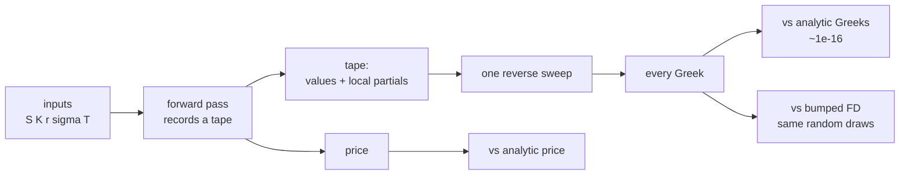

# aad-greeks

Adjoint (reverse-mode) automatic differentiation for option Greeks, checked
against analytic formulas to machine precision — and against the payoff where
it silently returns the wrong answer.

[](https://github.com/asp53826/aad-greeks/actions/workflows/ci.yml)


> A finite difference needs one revaluation per input. A reverse sweep produces
> every partial derivative at a constant multiple of the forward cost, no matter
> how many inputs there are. That claim is either true or it isn't, so this repo
> measures it — and then measures the case where the derivative it returns is
> exactly zero and exactly wrong.

## What is actually implemented

- a tape-based reverse-mode AD engine over numpy arrays, so one tape
  differentiates every Monte Carlo path simultaneously;
- correct adjoint accumulation for broadcast scalars, shared subexpressions,
  and reverse-order operands;
- pricers written **once** and evaluated either numerically or on the tape, so
  Greeks cannot drift away from the price the way hand-coded derivatives do;
- closed-form Black-Scholes, Monte Carlo European, arithmetic basket, and a
  cash-or-nothing digital;
- hand-derived analytic Greeks that share no code with the engine, used as the
  oracle;
- call-spread smoothing for the discontinuous payoff, with the bias it costs.



## Measured, not implied

Apple M-series, Python 3.13, numpy. Reproduce with `make bench`.

### The cost claim

One arithmetic basket, `n` assets, 40,000 paths. Parameters are the `n` spots
plus K, r, sigma, T.

| n assets | price (ms) | AAD (ms) | bump (ms) | AAD/price | bump/price | speedup |
|---:|---:|---:|---:|---:|---:|---:|
| 1 | 0.3 | 0.6 | 2.9 | **1.88** | 10.01 | 5.3× |
| 2 | 0.6 | 1.0 | 7.4 | **1.74** | 13.29 | 7.6× |
| 5 | 1.4 | 2.3 | 25.3 | **1.65** | 18.43 | 11.2× |
| 10 | 2.6 | 5.4 | 77.2 | **2.03** | 29.19 | 14.4× |
| 25 | 6.7 | 11.7 | 398.3 | **1.75** | 59.81 | 34.2× |
| 50 | 13.1 | 27.6 | 1469.0 | **2.11** | 112.48 | **53.3×** |

`AAD/price` is flat at roughly 1.7–2.1× across a 50× change in input count.
`bump/price` grows linearly, exactly as `2n+1` predicts. That is the entire
argument for adjoint methods, and it holds.

### The accuracy claim

Black-Scholes delta, closed form:

```
analytic   0.5987063256829237
AAD        0.5987063256829240      relative error 5.6e-16
```

Central differences, same quantity, as the bump shrinks:

| bump h | relative error |
|---:|---:|
| 1e+01 | 1.16e-02 |
| 1e-01 | 1.21e-06 |
| **1e-03** | **1.13e-10** ← best |
| 1e-06 | 4.64e-10 |
| 1e-08 | 1.48e-06 |
| 1e-10 | 1.14e-04 |

Truncation error falls with `h` until subtractive cancellation in the numerator
takes over and it climbs back. There is a sweet spot, it is problem-dependent,
and you do not know where it is in advance. AAD has neither error term — it
differentiates the program, not the function.

All five Greeks agree with the hand-derived formulas to `1e-12` or better across
five parameter regimes including deep-ITM, deep-OTM and short-dated low-vol.

### The memory cost

| paths | tape nodes | tape MB | bytes/path |
|---:|---:|---:|---:|
| 10,000 | 24 | 1.0 | 96 |
| 500,000 | 24 | 48.0 | 96 |

Node count is fixed by the program; memory scales with paths × operations. This
is AAD's real price and it is why production engines checkpoint rather than tape
everything.

## Where it loses

**Pathwise AAD returns exactly the wrong Greek for a discontinuous payoff, and
does not tell you.** Cash-or-nothing digital call, true delta 0.019333:

| method | delta | relative error |
|---|---:|---:|
| **pathwise AAD, sharp payoff** | **0.000000** | **100.0%** |
| central difference, h=0.5 | 0.019317 | 0.1% |
| AAD, call-spread smoothing h=1.0 | 0.019341 | 0.0% |
| AAD, call-spread smoothing h=0.25 | 0.019356 | 0.1% |

The payoff is a step function. Its derivative is zero almost everywhere, so the
reverse sweep faithfully propagates zero and reports a delta of 0 — no NaN, no
warning, no clue. The crude method the whole repo argues against gets it right
to 0.1%. The fix is to smooth the payoff into a call spread, which reintroduces
a bias you now have to choose.

The rest of the honest ledger:

- **Second-order Greeks are not implemented.** Gamma needs forward-over-reverse
  or a bump of the adjoint; one reverse sweep gives first derivatives only, and
  the flat cost claim above does not extend to the Hessian.
- **Python, and the tape is materialised in full.** No checkpointing, no
  tape compression, no operator fusion. The constant factor here (~1.8×) is
  flattered by numpy doing the real work in C — a scalar C++ tape would show a
  larger relative overhead.
- **No early exercise, no path dependence.** European payoffs on terminal values
  only. American options need a regression-based continuation value, whose
  differentiation has its own literature.
- **Bumping is compared with common random numbers.** Reusing the same normals
  across bumps is the favourable case for finite differences; with fresh draws
  the FD estimate is dominated by sampling noise and the comparison would look
  far better for AAD than it deserves.
- **The digital fix is a choice, not a solution.** Smoothing width trades price
  bias against derivative variance and the benchmark shows both directions.

## Verify it

```bash
make test    # 19 tests, no network
make bench   # ~11s, prints every table above
```

## Use it

```python
from aad.tape import grad
from aad.models import black_scholes_call, analytic_greeks

p = dict(S=100.0, K=105.0, r=0.03, sigma=0.22, T=1.5)
price, greeks, tape = grad(black_scholes_call, p)

greeks["S"]        # delta
greeks["sigma"]    # vega
greeks["T"]        # -theta
len(tape)          # 27 nodes for the whole closed form
```

Any function built from `Var` arithmetic is differentiable, so a new payoff
needs no derivative code:

```python
import numpy as np
from aad.models import mc_call

z = np.random.default_rng(0).standard_normal(200_000)
price, greeks, _ = grad(lambda **kw: mc_call(**kw, z=z), p)
```

## License

MIT
